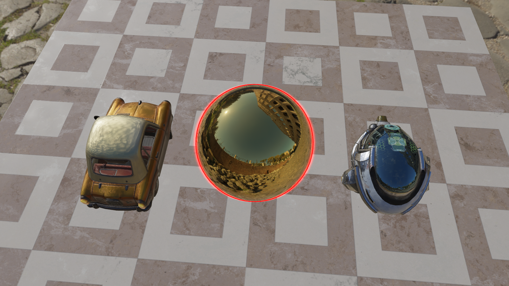

### IBLRenderer
IBLRenderer is a 3D renderer based on IBL(Image based lighting) written in C++ and OpenGL. 

#### Features
* IBL(Image Based Lighting)
* Anti-aliasing(MSAA)
* BVH(Bounding Volume Hierarchy)
* CastRay(Emit light from the camera and the visualization of the ray)
* Highlight the outline of the selected model
* Point-Lighting
* Shadows(ShadowMapping, PCF and PCSS, based on point light)
* Real-time visualization of the frame buffer content(Color, depth and stencil)
* Post-processing(Blur and sharpen)
* ScreenShot(Save the current frame's color buffer to out folder)
* Trackball camera(Using the mouse to change the position of the view, press the space bar on the keyboard to restore default settings)
* HDR and Gamma-correction
* PBR materials

#### ScreenShots
**Bvh hierarchy visualization**    
  
**Control panel**    
  
**Cast ray from camera and visualization**   
  
**Shadows(shadow mapping, pcf and pcss)**   
  
**Ibl viewer**   
  
**Highlight the outline of selected model by mouse**   
  
**Sharpen the image**   
  
**Blur the image(Gaussian blur)**   

#### Dependencies
* [GLFW](https://www.glfw.org/)-Library for creating a window with an OpenGL context
* [GLAD](https://glad.dav1d.de/)-Multi-Language GL/GLES/EGL/GLX/WGL Loader-Generator based on the official specs
* [GLM](https://glm.g-truc.net/0.9.9/index.html)-C++ mathematics library for graphics software based on the GLSL specifications
* [ASSIMP](https://github.com/assimp/assimp)-Library for loading 3D models from file 
* [STB-IMAGE](https://github.com/nothings/stb)-Library for loading images from files
* [ImGui](https://github.com/ocornut/imgui)-A bloat-free graphical user interface library for C++

#### License
This project is licensed under MIT License.

#### References
* [Learn OpenGL](https://learnopengl.com/)
* [Real Shading in Unreal Engine 4](http://blog.selfshadow.com/publications/s2013-shading-course/karis/s2013_pbs_epic_notes_v2.pdf)
* [GAMES101](https://sites.cs.ucsb.edu/~lingqi/teaching/games101.html)
* [GAMES202](https://sites.cs.ucsb.edu/~lingqi/teaching/games202.html)

